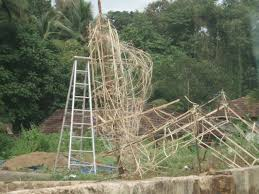
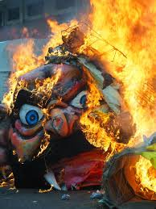

*This week’s topic:*
### Diwali in Goa: The Narkasur Dahan

Welcome to the 7th episode of Shri’s Podcast! In this episode, I will be talking about the unique custom of Narkasur Dahan, a very unusual and important pre-Diwali festivity celebrated by the people of Goa.

Diwali is the festival of lights. Diwali falls on the 'Amavasya' or new moon day of the 'Karthik' month In the Hindu calendar; usually falling somewhere in October or November. Diwali is a very important festival for a lot of Hindus around the world and is celebrated with a lot of pomp and glory by a lot of people.  For the people in Goa though. Diwali brings a new kind of excitement to everyone. For Goans, the day before Diwali is as auspicious as the day itself. Every year the day before Diwali is celebrated as the ‘Narkasur Dahan Din’. This is a festival, unique to Goa, and is celebrated in a way that is perhaps not seen anywhere else in the world.

Preparations for the day begin as early as a month. For some bigger effigies, it starts even earlier All youth from a particular area get together and raise donations for the area's Narkasur effigies. People from the ward or that particular area usually donate very handsomely towards the making of these effigies, mainly politicians in exchange for their and their party banners being displayed next to the effigy, getting them cheap yet effective marketing at the grassroots level. Some also donate in kind, sponsoring lightings, material, paint, music systems, etc. Over time, a mere pre-festival custom grew up to be a full-fledged festival of its own with competitions, prizes, and money. But it would be fair to say that it is mostly the enthusiasm of the local youth and natives that has still kept this tradition alive and will continue to do so.

The effigies themselves are a wonder of their own. From being a mere equivalent to a scarecrow wrapped in better costume, they have changed quite a lot, both in size and make. The effigies are usually made of jute sack, newspaper, plain paper, and loads of glue all stuck together on either a metal or a bamboo frame. The metal frames are usually very costly but reliable and efficient, saving a lot of time each year in making a new one, unlike the bamboo frames, which takes a lot of time to make, need skill, and are not re-usable as they get destroyed after the effigy is burnt. Once all the paper, jute sack and everything else is neatly applied on the frame with glue (The Bamboo frames have to be stuffed with hay to make it sturdier, increasing weight and decreasing portability, meaning they have to be constructed as it has to be displayed in the very place you want to display it, another disadvantage of the bamboo frame), they are then painted to look their ferocious best with all sorts of colors, implants, etc. The Face i.e., the Mask of the effigy is also handmade, by first making a model on the ground with mud and clay and then applying a paper mâché mixture and allowing it to dry for a couple of days. Some people are especially skilled in making the mask alone and is considered a passed-down skill. Once fully complete, these are put on full display to the public along with other smaller Narkasuras that the local kids might have prepared. Some Narkasur effigies are huge! as much as 50-60 feet! (I’m not kidding!) attracting a lot of attraction and awe of visitors. Some even make mini Narkasuras that are around 1-2 feet and stick them Infront of their cars and scooters as they roam around, just for fun's sake. Coupled with loud EDMs and lighting, the people dance the whole night and celebrate their hard work in making it and the spirit of Diwali.

Like all good things, even The Narkasur Dahan has to come to an end, with the Dahan itself. At dawn on the day of Diwali, these effigies are burnt down, marking that no matter how good evil may seem to be, it has to go sooner or later. This also marks the symbolic advance of Diwali as Krishna had slain the Demon, Narkasur in mythology, and that is why Diwali is celebrated. There are competitions of all sorts during this time with participants going all-in making their Narkasur the best, some even depicting scenes of Narkasura being slain by Lord Krishna with surreal light and sound effects. A lot of people from all over Goa gather together to witness these competitions and celebrate Diwali and where you go during the day, you are bound to see a Narkasur or two.

The Narkasur Dahan is a very unique festival that is difficult to describe in words. So, next time you visit Goa, make sure to visit around this time of the year to witness this unique and fun festival that you probably won’t get to see anywhere else in the world! 

